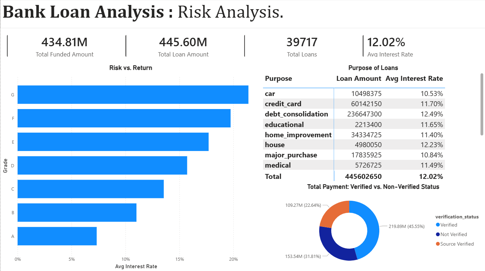
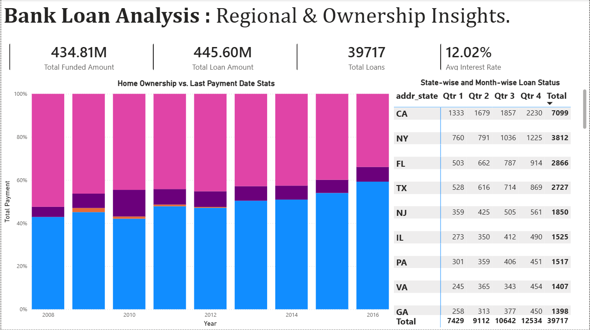
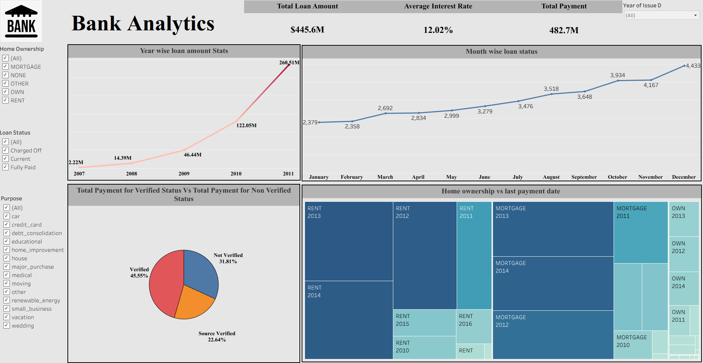
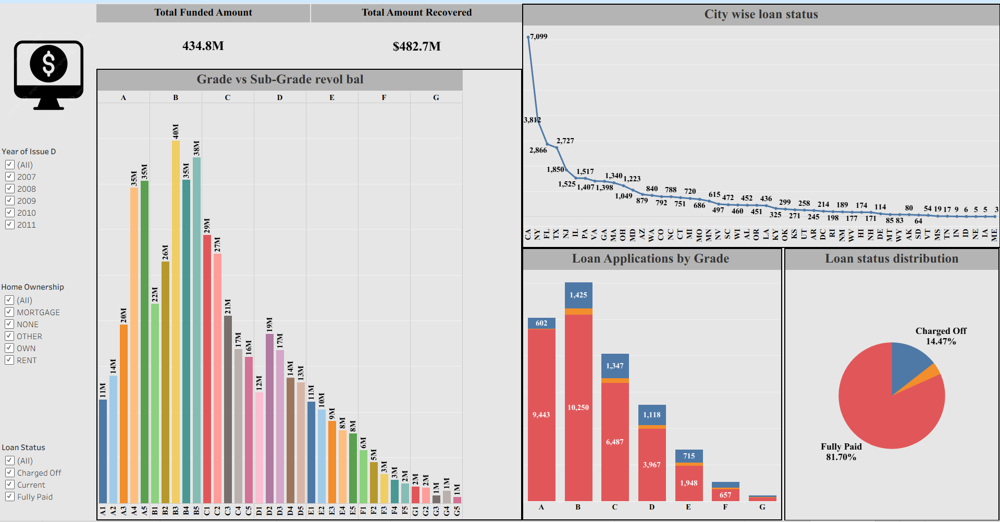

# 🏦 Bank Loan Analysis — Ai Variant Internship Project

> A comprehensive end-to-end data analytics project on bank loan data, covering data cleaning, dashboarding, and SQL-based analysis. This project was completed as a group internship project under **Ai Variant**.

---

## 📁 Project Structure

```
Ai-Variant-Bank-Loan-Analysis/
├── dashboard/
│   ├── excel/          → Excel Dashboard (.xlsx)
│   ├── powerbi/        → Power BI Report (.pbix)
│   └── tableau/        → Tableau Workbook (.twbx)
├── data/
│   ├── raw/            → Original raw datasets (finance_1.csv, finance_2.xlsx)
│   └── processed/      → Cleaned dataset (clean.xlsx)
├── documentation/
│   ├── doc/            → Project documentation
│   └── presentation/   → Final presentation (PPT)
├── screenshorts/       → Dashboard screenshots (Power BI & Tableau)
└── sql_scripts/        → MySQL analysis scripts
```

---

## 🔄 Project Workflow

### Step 1 — Data Cleaning (Excel)
The raw data was imported into **Microsoft Excel** and cleaned thoroughly:
- Removed duplicate records
- Handled null and missing values (e.g., `mths_since_last_delinq` converted from `NA` to numeric)
- Standardized column formats (dates, percentages, currency)
- Created calculated columns like `loan_year`, `loan_status_group`
- Output saved as `clean.xlsx` in the processed folder

### Step 2 — Excel Dashboard
An interactive dashboard was built in Excel using pivot tables and charts to provide a quick summary view of key metrics.

### Step 3 — Power BI Dashboard
Three detailed dashboards were created in Power BI for deep analysis:
- **Executive Overview**
- **Risk Analysis**
- **Regional & Ownership Insights**

### Step 4 — Tableau Dashboard
Two interactive dashboards were created in Tableau:
- **Bank Analytics Overview**
- **Grade & City-wise Loan Analysis**

### Step 5 — SQL Analysis
MySQL queries were written to validate and extract insights from the cleaned data covering KPIs, trends, and risk analysis.

---

## 📊 Key Performance Indicators (KPIs)

| KPI | Value |
|-----|-------|
| 💰 Total Loan Amount | **$445.60 Million** |
| 🏦 Total Funded Amount | **$434.81 Million** |
| 💵 Total Amount Recovered | **$482.7 Million** |
| 📋 Total Loans Issued | **39,717** |
| 📈 Average Interest Rate | **12.02%** |

---

## 📉 Portfolio Health

| Loan Status | Count | Percentage |
|------------|-------|-----------|
| ✅ Fully Paid | ~33K | **82.96%** |
| ❌ Defaulted | ~6K | **14.17%** |
| 🔄 Active/Current | ~1K | **2.87%** |

> **Charged Off Percentage: 14.47%**

---

## 📌 Dashboard Insights

### Power BI — Executive Overview


- Loan amount grew exponentially from **$2.2M in 2007** to **$260.5M in 2011**, showing rapid credit expansion.
- Grade **B** has the highest revolving balance at **$161M**, followed by Grade A at **$114M**.
- The portfolio is healthy with over **82% of loans fully paid**.

---

### Power BI — Risk Analysis


- Higher loan grades (F, G) carry **significantly higher interest rates (17–20%)**, reflecting greater credit risk.
- **Debt consolidation** is the most common purpose with **$236.6M** in loans at 12.49% avg rate.
- **45.55% of total payments** come from verified borrowers, while 31.81% are from non-verified sources — indicating room to improve verification processes.

---

### Power BI — Regional & Ownership Insights


- **California (CA)** leads all states with **7,099 loans** followed by New York (3,812) and Florida (2,866).
- Mortgage holders consistently make up the largest portion of borrowers year-over-year.
- Loan volume steadily increases each quarter — Q4 is always the highest performing quarter.

---

### Tableau — Bank Analytics Overview


- Clear **seasonal trend** in loan issuance — December shows the highest monthly count at **4,433 loans**.
- Loan amounts grew consistently year-over-year from 2007 to 2011.
- Mortgage and Rent borrowers dominate across all years.

---

### Tableau — Grade & City-wise Analysis


- Sub-grade **B3 and B4** have the highest revolving balances (~$40M each).
- **81.70% of loans are fully paid**, with only 14.47% charged off — a strong repayment performance.
- Loan applications peak at **Grade B (11,675 total)** followed closely by Grade A (10,045).

---

## 🗄️ SQL Analysis Highlights

The SQL script (`sql_scripts/bank_analysis_scripts.sql`) covers the following analyses:

```sql
-- Key analyses performed:
✔ Total Loans Count
✔ Total Loan Amount & Funded Amount
✔ Average Interest Rate
✔ Loan Status Distribution (Fully Paid / Defaulted / Active)
✔ Loan Amount by Status
✔ Year-wise Loan Issuance Trend
✔ Loan Amount Trend by Year
✔ Grade-wise Loan Count and Amount
✔ Purpose-wise Loan Analysis
✔ State-wise Loan Distribution
✔ Average Income by Loan Status
✔ Average DTI (Debt-to-Income) by Loan Status
✔ Charged Off Loan Percentage
✔ Top 10 Highest Loan Borrowers
```

**Key SQL Findings:**
- Borrowers with **lower income** are more likely to default or be charged off
- **Debt consolidation** accounts for the majority of loan volume
- States like **CA, NY, FL, TX** dominate loan distribution
- Charged off borrowers tend to have higher DTI ratios

---

## 💡 Suggestions & Recommendations

1. **Tighten verification:** With 31.81% of payments coming from non-verified borrowers, improving verification processes could reduce default risk.
2. **Monitor Grade F & G loans:** These carry 17–20% interest rates — while profitable, they have higher risk of charge-off.
3. **Focus on high-performing states:** CA, NY, FL, and TX are top markets; targeted campaigns in these regions could maximize returns.
4. **Seasonal lending strategy:** December sees peak loan applications — banks should prepare capital reserves ahead of Q4.
5. **Debt consolidation dominance:** Since debt consolidation accounts for 53%+ of all loans, risk models should be specifically calibrated for this segment.

---

## ✅ Conclusion

This project provides a complete 360° view of bank loan performance using a multi-tool analytics approach. Starting from raw data cleaning in Excel, through visual storytelling in Power BI and Tableau, and validated by SQL queries — the analysis reveals a generally healthy loan portfolio with a **82.96% repayment rate**. Key risk areas include high-grade loans (F, G), non-verified borrowers, and specific geographic concentrations. The insights generated can help financial institutions make smarter lending decisions, reduce default rates, and optimize their loan portfolios.

---

## 🛠️ Tools & Technologies Used

| Tool | Purpose |
|------|---------|
| Microsoft Excel | Data Cleaning & Excel Dashboard |
| Power BI | Interactive BI Dashboards (3 pages) |
| Tableau | Visual Analytics (2 dashboards) |
| MySQL | Data Analysis via SQL Queries |
| Git & GitHub | Version Control & Project Hosting |

---

## 👥 License & Credits

This project was developed as a **group internship project** under **Ai Variant**.

All rights reserved © Ai Variant Internship Group.

This repository is intended for **educational and portfolio purposes only**. The dataset used is for academic analysis and does not represent real customer data.

---

## 📬 Contact

For any queries regarding this project, feel free to reach out via GitHub: [@imskipper](https://github.com/imskipper)
